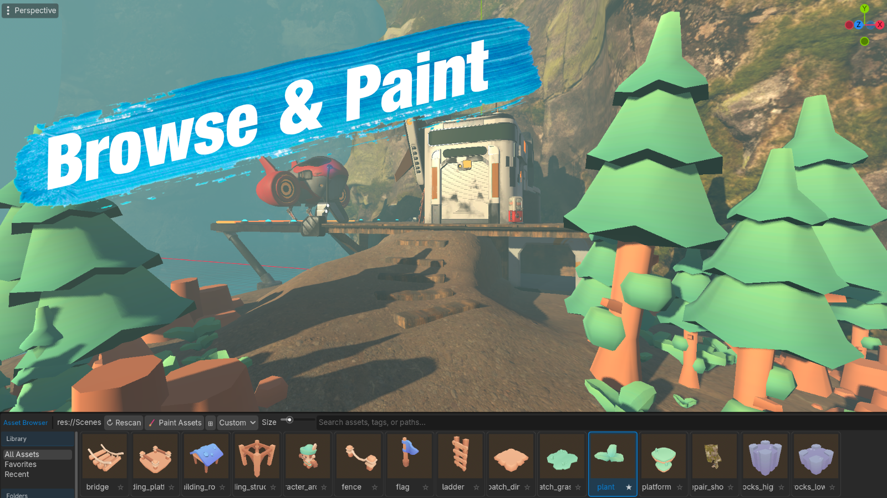

# Asset Browser
### A Fast, Professional Asset Painting & Placement Tool for Godot 4

<p align="center">
  
</p>

<p align="center">


</p>

---

## Overview

Asset Browser is a powerful editor plugin for Godot 4 that makes building levels dramatically faster.

Instead of manually dragging scenes into your level one at a time, Asset Browser lets you browse your libraries, organize assets into folders and collections, and paint objects directly into your scene with professional placement tools.

Whether you're building forests, cities, dungeons, interiors, or open worlds, Asset Browser provides an efficient workflow while remaining simple enough for beginners.

---

# Features

## Asset Library

- Multiple asset folders
- Unlimited assets
- Thumbnail previews
- Fast searching
- Asset filtering
- Folder organization
- Collections
- Favorites
- Multi-selection

---

## Painting Tools

Paint assets directly into your scene using your mouse.

Supports:

- Free Paint
- Grid Paint
- Surface Paint
- Random Asset Selection
- Random Rotation
- Random Scale
- Random Yaw
- Random Pitch
- Random Roll
- Random Offset

---

## Placement Tools

Quickly place assets using several placement modes.

- Surface Placement
- Grid Placement
- Free Placement
- Snap to Surface
- Align to Surface Normal
- Manual Placement

---

## Brush Controls

Customize exactly how assets are painted.

- Brush Radius
- Brush Density
- Brush Spacing
- Random Rotation
- Random Scale
- Random Height Offset
- Collision Checking
- Overlap Prevention

---

## MultiMesh Support

Paint thousands of objects efficiently using MultiMesh.

Perfect for:

- Grass
- Rocks
- Small Decorations
- Foliage
- Ground Clutter

---

## Collections

Organize frequently used assets.

Examples:

```
Nature
    Trees
    Bushes
    Rocks

Buildings
    Houses
    Walls
    Props

Sci-Fi
    Doors
    Consoles
    Pipes
```

Collections make switching between groups of assets instant.

---

## Search

Find assets instantly.

Search by:

- Name
- Folder
- Collection

---

## Undo / Redo

Every placement operation supports:

- Undo
- Redo

allowing safe experimentation while building levels.

---

# Installation

## Install from GitHub

1. Download the repository.
2. Copy the `addons/asset_browser` folder into your project.
3. Open **Project → Project Settings → Plugins**
4. Enable **Asset Browser**.

The dock will now appear inside the editor.

---

# Quick Start

## 1. Add Asset Folders

Click the **Folder** button.

Choose one or more folders that contain scenes.

Example:

```
res://Assets/
res://Environment/
res://Props/
```

The Asset Browser will scan these folders automatically.

---

## 2. Select an Asset

Click any asset in the library.

A preview will appear.

You can also select multiple assets for random painting.

---

## 3. Choose a Paint Mode

Select one of the available paint modes.

### Surface

Paint directly onto existing geometry.

Best for:

- Rocks
- Trees
- Decorations

---

### Grid

Paint aligned to a fixed grid.

Best for:

- Modular buildings
- Walls
- Floors
- Tile-based worlds

---

### Free

Place assets without snapping.

Best for:

- Manual positioning
- Fine adjustments

---

## 4. Paint

Move the mouse into the 3D viewport.

Click to place assets.

Hold and drag to paint continuously.

---

# Interface

## Library

Displays every discovered asset.

Supports:

- Search
- Filtering
- Multi-selection

---

## Folder List

Displays every registered asset folder.

Selecting a folder filters the asset list.

The **All Folders** entry displays every asset.

---

## Collections

Collections are custom groups of assets.

Right-click assets to add them to collections.

---

## Preview

Shows the currently selected asset.

---

## Inspector

Displays brush settings and placement options.

---

# Brush Settings

## Radius

Controls the size of the paint brush.

---

## Density

Controls how many assets are placed during each stroke.

Higher values produce denser placement.

---

## Grid Size

Controls spacing while Grid mode is active.

---

## Rotation Randomization

Randomly rotates each placed asset.

Useful for natural variation.

---

## Scale Randomization

Randomly scales each asset.

Perfect for vegetation.

---

## Height Offset

Offsets placed assets vertically.

Useful for preventing clipping.

---

# Multi-Selection

Select multiple assets.

The painter will randomly choose one during placement.

Great for:

- Rocks
- Trees
- Crates
- Plants

This creates natural variation automatically.

---

# Collections

Create collections to organize commonly used assets.

Example:

```
Forest

Trees
Bushes
Logs
Flowers
Rocks
```

Switch collections with one click.

---

# Best Practices

### Keep Similar Assets Together

Organize assets into folders such as:

```
Environment
Props
Buildings
Nature
Characters
```

---

### Use Collections

Collections are ideal for:

- Dungeon kits
- Forest kits
- Village kits
- Sci-Fi kits

---

### Use Grid Mode

Grid mode is ideal for:

- Walls
- Floors
- Buildings
- Modular pieces

---

### Use Surface Mode

Surface mode works best for:

- Rocks
- Grass
- Trees
- Decorations

---

### Randomization

Adding slight random:

- Rotation
- Scale
- Height

creates much more natural-looking environments.

---

# Keyboard & Mouse

| Action | Description |
|---------|-------------|
| Left Click | Place asset |
| Click + Drag | Paint continuously |
| Ctrl+Z | Undo |
| Ctrl+Shift+Z | Redo |

---

# Tips

- Use folders to organize large libraries.
- Create collections for frequently used assets.
- Multi-select similar assets for natural variation.
- Use Grid mode for modular environments.
- Use Surface mode for organic scenes.
- Use random rotation and scale for realistic placement.

---

# Troubleshooting

## Assets do not appear

- Verify the asset folder has been added.
- Ensure the folder contains valid scenes.
- Refresh the library if necessary.

---

## Cannot paint

Verify:

- An asset is selected.
- A paint mode is active.
- A valid surface exists under the cursor.

---

## Grid painting is not aligned

Check:

- Grid mode is enabled.
- Grid size is appropriate for your assets.

---

## Undo behaves unexpectedly

Undo only affects placement operations performed through Asset Browser.

---

# Performance Tips

For large environments:

- Use MultiMesh where appropriate.
- Group similar assets.
- Keep randomization reasonable.
- Organize libraries into multiple folders.

---

# Contributing

Contributions are welcome.

Please open an Issue or Pull Request with:

- Bug reports
- Feature requests
- Improvements
- Documentation updates

---

# License

This project is released under the MIT License.

---

# Support

If you encounter a bug or have a feature request, please open an issue on GitHub.

If you enjoy the plugin, consider starring the repository to support future development.

---

<p align="center">

**Happy Building!**

Made with ❤️ for the Godot Community.

</p>
